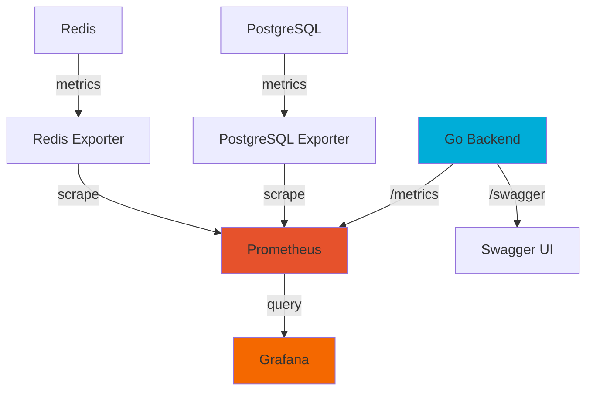

# Monitoring & Observability Guide

## Overview

SAuthenServer includes a comprehensive monitoring and observability stack:

- **Prometheus** - Metrics collection and storage
- **Grafana** - Metrics visualization and dashboards
- **Swagger/OpenAPI** - Auto-generated API documentation
- **Docker** - Full containerization

## Architecture



## Components

### 1. Prometheus

**Purpose:** Metrics collection and time-series database

**Access:** http://localhost:9090

**Metrics Collected:**
- HTTP request rate
- Response times (histograms)
- Error rates
- Memory usage
- Goroutine count
- Database connection pool stats
- Redis cache hit/miss ratio
- Custom business metrics

**Configuration:** `monitoring/prometheus/prometheus.yml`

**Scrape Targets:**
- Backend API: `backend:8080/metrics`
- PostgreSQL: `postgres-exporter:9187/metrics`
- Redis: `redis-exporter:9121/metrics`
- Traefik: `traefik:8082/metrics`

### 2. Grafana

**Purpose:** Metrics visualization and dashboards

**Access:** http://localhost:3001

**Default Credentials:**
- Username: `admin`
- Password: `admin` (change on first login)

**Pre-configured Dashboards:**
- **SAuthenServer Metrics** - Main dashboard with:
  - Request rate
  - Response time (p50, p95, p99)
  - HTTP status codes
  - Memory usage
  - Error rates
  - Active sessions

**Dashboard Location:** `monitoring/grafana/provisioning/dashboards/json/`

**Custom Dashboard Creation:**
1. Login to Grafana
2. Click "+" → "Dashboard"
3. Add panels with Prometheus queries
4. Save dashboard

### 3. Swagger/OpenAPI Documentation

**Purpose:** Auto-generated API documentation from code comments

**Access:** http://localhost:8080/swagger/index.html

**Features:**
- Interactive API testing
- Request/response schemas
- Authentication testing
- Example requests/responses

**Generation:**
```bash
# Generate Swagger docs
make swagger

# Format Swagger annotations
make swagger-fmt
```

**Example Annotation:**
```go
// @Summary User login
// @Description Authenticate user with email and password
// @Tags auth
// @Accept json
// @Produce json
// @Param request body LoginRequest true "Login credentials"
// @Success 200 {object} LoginResponse
// @Failure 400 {object} ErrorResponse
// @Failure 401 {object} ErrorResponse
// @Router /auth/login [post]
func loginHandler(c *fiber.Ctx) error {
    // implementation
}
```

### 4. PostgreSQL Exporter

**Purpose:** Detailed PostgreSQL metrics

**Metrics:**
- Connection pool stats
- Query performance
- Lock statistics
- Database size
- Transaction rates

### 5. Redis Exporter

**Purpose:** Detailed Redis metrics

**Metrics:**
- Memory usage
- Key count
- Hit/miss ratio
- Connected clients
- Commands per second

## Getting Started

### Quick Start

```bash
# Start all services including monitoring
docker-compose up -d

# Access services
# Grafana:     http://localhost:3001
# Prometheus:  http://localhost:9090
# Swagger:     http://localhost:8080/swagger/index.html
```

### Development Setup

1. **Generate Swagger Documentation:**
```bash
# Install swag
go install github.com/swaggo/swag/cmd/swag@latest

# Generate docs
make swagger
```

2. **Start Monitoring Stack:**
```bash
# Start only monitoring services
docker-compose up -d prometheus grafana

# Or start everything
docker-compose up -d
```

3. **Access Dashboards:**
- Open Grafana: http://localhost:3001
- Login with admin/admin
- Navigate to Dashboards → SAuthenServer Metrics

## Custom Metrics

### Adding Custom Metrics in Go

```go
package main

import (
    "github.com/prometheus/client_golang/prometheus"
    "github.com/prometheus/client_golang/prometheus/promauto"
)

var (
    loginAttempts = promauto.NewCounterVec(
        prometheus.CounterOpts{
            Name: "sauthenserver_login_attempts_total",
            Help: "Total number of login attempts",
        },
        []string{"status", "provider"},
    )
    
    activeUsers = promauto.NewGauge(
        prometheus.GaugeOpts{
            Name: "sauthenserver_active_users",
            Help: "Number of currently active users",
        },
    )
)

func recordLoginAttempt(success bool, provider string) {
    status := "success"
    if !success {
        status = "failure"
    }
    loginAttempts.WithLabelValues(status, provider).Inc()
}
```

### Querying in Prometheus

**Request Rate:**
```promql
rate(http_requests_total{job="sauthenserver-backend"}[5m])
```

**Error Rate:**
```promql
rate(http_requests_total{job="sauthenserver-backend", status=~"5.."}[5m])
```

**P95 Response Time:**
```promql
histogram_quantile(0.95, rate(http_request_duration_seconds_bucket[5m]))
```

**Memory Usage:**
```promql
process_resident_memory_bytes{job="sauthenserver-backend"}
```

## Alerting

### Creating Alerts in Prometheus

Create `monitoring/prometheus/alerts.yml`:

```yaml
groups:
  - name: sauthenserver_alerts
    interval: 30s
    rules:
      # High error rate
      - alert: HighErrorRate
        expr: rate(http_requests_total{status=~"5.."}[5m]) > 0.05
        for: 5m
        labels:
          severity: critical
        annotations:
          summary: "High error rate detected"
          description: "Error rate is {{ $value }} errors/sec"
      
      # Slow response time
      - alert: SlowResponseTime
        expr: histogram_quantile(0.95, rate(http_request_duration_seconds_bucket[5m])) > 1
        for: 5m
        labels:
          severity: warning
        annotations:
          summary: "Slow API response time"
          description: "P95 latency is {{ $value }}s"
      
      # High memory usage
      - alert: HighMemoryUsage
        expr: process_resident_memory_bytes > 500000000
        for: 5m
        labels:
          severity: warning
        annotations:
          summary: "High memory usage"
          description: "Memory usage is {{ $value | humanize }}B"
```

Update `prometheus.yml`:
```yaml
rule_files:
  - "alerts.yml"
```

## Grafana Dashboard Customization

### Adding New Panels

1. **Login to Grafana:** http://localhost:3001
2. **Open Dashboard:** SAuthenServer Metrics
3. **Add Panel:** Click "Add panel"
4. **Configure Query:**
   - Select Prometheus datasource
   - Enter PromQL query
   - Configure visualization

### Example Queries

**Active Sessions:**
```promql
sauthenserver_active_sessions
```

**Login Success Rate:**
```promql
rate(sauthenserver_login_attempts_total{status="success"}[5m]) / 
rate(sauthenserver_login_attempts_total[5m])
```

**Database Connection Pool:**
```promql
pg_stat_database_numbackends{datname="skoservice"}
```

## Logging

### Structured Logging

The backend uses structured JSON logging:

```go
log.Printf("User login: user_id=%s, ip=%s, success=%t", 
    userID, ipAddress, success)
```

### Log Aggregation (Optional)

For production, consider:
- **ELK Stack** (Elasticsearch, Logstash, Kibana)
- **Loki** (with Grafana)
- **CloudWatch** (AWS)
- **Stackdriver** (GCP)

## Performance Profiling

### pprof Integration

Access profiling endpoints:
- CPU Profile: http://localhost:8080/debug/pprof/profile
- Heap Profile: http://localhost:8080/debug/pprof/heap
- Goroutines: http://localhost:8080/debug/pprof/goroutine

### Analyzing Profiles

```bash
# CPU profile (30 seconds)
go tool pprof http://localhost:8080/debug/pprof/profile?seconds=30

# Heap profile
go tool pprof http://localhost:8080/debug/pprof/heap

# In pprof:
(pprof) top10
(pprof) web
```

## Health Checks

### Endpoints

- **Basic Health:** `GET /health`
  ```json
  {
    "status": "ok",
    "service": "SAuthenServer",
    "version": "2.0.0"
  }
  ```

- **Detailed Health:** `GET /health/detailed`
  ```json
  {
    "status": "ok",
    "checks": {
      "database": "ok",
      "redis": "ok",
      "memory": "ok"
    },
    "uptime": "2h34m12s"
  }
  ```

### Docker Health Checks

Already configured in `docker-compose.yml`:
```yaml
healthcheck:
  test: ["CMD", "curl", "-f", "http://localhost:8080/health"]
  interval: 30s
  timeout: 10s
  retries: 3
```

## Production Monitoring

### Recommended Setup

1. **Prometheus:**
   - Persistent storage
   - Retention policy (15+ days)
   - Remote write to long-term storage

2. **Grafana:**
   - HTTPS enabled
   - SSO integration
   - Email/Slack alerts
   - Dashboard permissions

3. **Alerting:**
   - Alertmanager for routing
   - PagerDuty/Opsgenie integration
   - Escalation policies

### Cloud Monitoring Options

**AWS:**
- CloudWatch for metrics
- X-Ray for tracing
- CloudWatch Logs for log aggregation

**GCP:**
- Cloud Monitoring (Stackdriver)
- Cloud Trace
- Cloud Logging

**Azure:**
- Azure Monitor
- Application Insights
- Log Analytics

## Troubleshooting

### Common Issues

**Prometheus not scraping:**
```bash
# Check Prometheus targets
curl http://localhost:9090/api/v1/targets

# Check backend metrics endpoint
curl http://localhost:8080/metrics
```

**Grafana dashboard empty:**
- Verify Prometheus datasource is configured
- Check Prometheus has data: http://localhost:9090/graph
- Verify time range in dashboard

**Swagger docs not showing:**
```bash
# Regenerate Swagger docs
make swagger

# Check for errors in backend logs
docker-compose logs backend
```

## Best Practices

1. **Metrics:**
   - Use counters for cumulative values
   - Use gauges for current values
   - Use histograms for distributions
   - Label metrics appropriately

2. **Dashboards:**
   - Group related metrics
   - Use appropriate time ranges
   - Add descriptions/annotations
   - Set up alerts for critical metrics

3. **Alerting:**
   - Alert on symptoms, not causes
   - Avoid alert fatigue
   - Set appropriate thresholds
   - Include actionable information

4. **Documentation:**
   - Keep Swagger docs updated
   - Document all API endpoints
   - Include examples
   - Version your API

## Resources

- [Prometheus Documentation](https://prometheus.io/docs/)
- [Grafana Documentation](https://grafana.com/docs/)
- [Swagger/OpenAPI Specification](https://swagger.io/specification/)
- [Go Prometheus Client](https://github.com/prometheus/client_golang)
- [Swaggo Documentation](https://github.com/swaggo/swag)

## Monitoring Checklist

- [ ] Prometheus collecting metrics
- [ ] Grafana dashboards configured
- [ ] Swagger documentation generated
- [ ] Health checks working
- [ ] Alerts configured
- [ ] Log aggregation setup
- [ ] Profiling enabled
- [ ] Performance baselines established
- [ ] On-call runbooks created
- [ ] Team trained on monitoring tools
